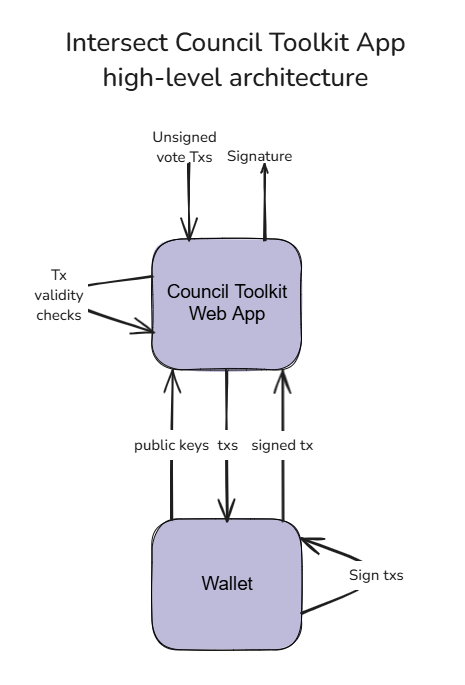

# Intersect Council Toolkit App

This App will allow Intersect council to be able to vote on governance actions, by connecting their wallet to this app.

## Table of Contents

1. [Usage](#usage)
2. [Architecture](#architecture)
3. [License](#license)

## Usage

1. Connect your wallet to the app.
2. Make sure you are on the mainnet or pre-prod for testing.
3. Paste your unsigned transaction on the input box, then click check transaction.
4. If the unsigned transaction passes all validity checks you will be able to pass the transaction to your wallet for signing, producing a signature.

## Architecture

